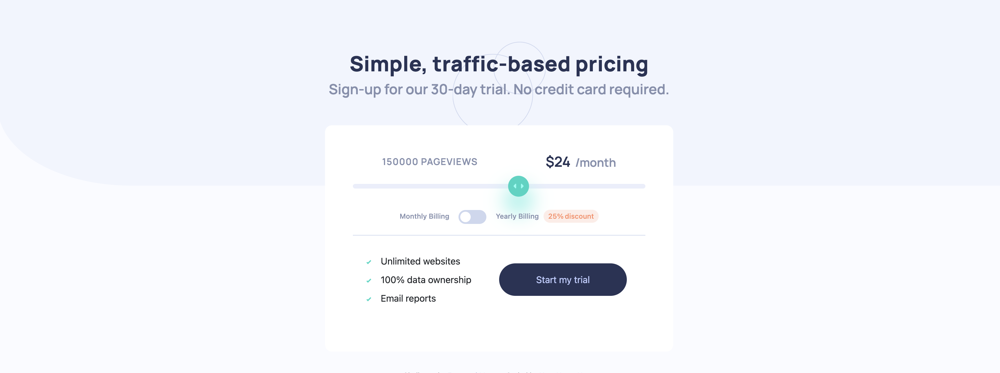

# Frontend Mentor - Interactive pricing component solution

This is a solution to the [Interactive pricing component challenge on Frontend Mentor](https://www.frontendmentor.io/challenges/interactive-pricing-component-t0m8PIyY8). Frontend Mentor challenges help you improve your coding skills by building realistic projects. 


## Table of contents

- [Welcome & Overview](#welcome-👋)
  - [The challenge](#the-challenge)
  - [Where to find everything](#where-to-find-everything)
  - [Running the Project](#running-the-project)
  - [Deploying the Project](#deploying-the-project)
  - [Screenshot](#screenshot)
  - [Links](#links)
- [My process](#my-process)
  - [Built with](#built-with)
  - [What I learned](#what-i-learned)
  - [Continued development](#continued-development)
  - [Useful resources](#useful-resources)
- [Author](#author)

## Welcome 👋

This Front End Mentor challenge was to build a pricing component that shows how much it would cost to ensure a certain number of page views. There was a monthly and yearly price, with the yearly price offering a 25% discount. 

Users can move the slider to see corresponding prices and page views, as well as toggle between monthly billing and yearly billing. 

### The challenge

Besides creating a project that matches the designs as close as possible, users should be able to:

- View the optimal layout for the app depending on their device's screen size
- See hover states for all interactive elements on the page
- Use the slider and toggle to see prices for different page view numbers

The different page view ranges and the corresponding monthly price totals are as follows:

- 10K page views / $8 per month
- 50K page views / $12 per month
- 100K page views / $16 per month
- 500k page views / $24 per month
- 1M page views / $36 per month

If the visitor switches the toggle to yearly billing, a 25% discount should be applied to all prices.

### Where to find everything

If you would like to see the static design files, you may find them in the `design` folder. You'll see both a mobile and a desktop version.

There is also a `style-guide.md` file containing the information regarding the designs, such as color palette and fonts. Additionally, any required assets in the `/images` folder.

The `main` branch of this project **DOES NOT** fulfill the project's description. The `refactor--oop-pricing` does, but both branches work very similarly. Honestly speaking, I did not read far enough into the description before I started to build, so the main branch creates the amount of page views, based on a bunch of math I did to determine how many pages $1 could purchase. `refactor--oop-pricing` follows the page view ranges and prices listed in the section above.

### Running the Project
1. Clone or fork this repo
2. Run `npm install` to get all dependencies
3. Run `npm run start` to open the Webpack server. You'll still need to refresh the page after each HTML change, but Webpack will continue to watch for and build style changes automatically (like a hot reload).
4. Visit `localhost:8080` to see the dev version of the site
5. Run `npm run lint:js` if you'd like to lint `app.js` 
6. Run `npm run lint:css` if you'd like to lint any of the SCSS files
7. `npm run build` compiles a single instance of the site into a `dist` folder

### Deploying the Project

There are many ways to host your project for free. Recommended hosts are:

- [GitHub Pages](https://pages.github.com/)
- [Vercel](https://vercel.com/)
- [Netlify](https://www.netlify.com/)

You can see the main deployed branch via Netlify [here](https://main--verdant-kringle-c7203c.netlify.app/), as well as the deploy preview for the [OOP solution](https://deploy-preview-4--verdant-kringle-c7203c.netlify.app/).

### Screenshot



### Links

- OOP Solution URL: [OOP solution to fulfill the brief](https://www.frontendmentor.io/solutions/oop-scss-webpack-linting-01COli6hav)
- OOP Live Site URL: [OOP solution site](https://deploy-preview-4--verdant-kringle-c7203c.netlify.app/)
- Main Branch Solution Repo (not OOP): [Main branch code that doesn't fulfill the brief](https://github.com/marissahuysentruyt/interactive-pricing-component/tree/main)
- Main Branch Site URL: [Main branch site](https://main--verdant-kringle-c7203c.netlify.app/)

## My process

With this project, I wanted to use as much as I could when it came to dependencies, technologies and languages. Based off of another Front End Mentor project, I got SCSS & Webpack installed and configured to build properly. Then I decided to dive a little deeper into Webpack and try to figure out how to get the server to watch for changes and automatically reload the site for me. I don't think I have it exactly right, but it is reloading style changes specifically, so that's an improvement from the last time I installed Webpack! 

First, I focused on getting the semantic structure of the HTML set up as best I could. Then (without reading the directions...😬), I started working on the JavaScript functionality, and slowly putting styles on elements with SCSS. For the JavaScript, I did a little math, working backwards to figure out how many page views a single dollar would get a person, and created several functions to calculate page views based on the prices in the `range` input (the slider). I also decided to include the Bootstrap toggle/switch to cut down on the amount of time I'd have to spend programming the monthly vs. yearly toggle. 

It was then suggested to me to do something like a strikethrough if users clicked on the yearly pricing toggle. This meant adding the `line-through` styles to HTML elements. Overall, this approach seemed to include quite a bit of repetition, which is what actually prompted me to look back at the initial instructions for the project.

After seeing that there was a set amount of page views that corresponded to a set number of prices, I needed to refactor. I created an object that used those 2 data points as `key-value` pairs. Because the `pagesAndPrices` object was now connected correctly, my slider position could correspond to the values at certain positions in the `views` or `prices` arrays. That cut out some of the repetitive code I had. 

**Lesson learned: always read the directions twice!**

### Built with

- Semantic HTML5 markup
- CSS custom properties
- [SCSS](https://sass-lang.com/documentation/)
- [ITCSS](https://www.xfive.co/blog/itcss-scalable-maintainable-css-architecture/#:~:text=in%20some%20blanks.-,What%20is%20ITCSS%3F,namespace%2C%20cascade%20and%20selectors%20specificity)
- Flexbox
- CSS Grid
- [Bootstrap](https://getbootstrap.com/docs/5.3/forms/checks-radios/#switches)
- Object-Oriented Programming (OOP)
- Mobile-first workflow
- [Webpack](https://webpack.js.org/concepts/)
- Linters: [Stylelint](https://stylelint.io/), [ESLint](https://eslint.org/docs/latest/), [Prettier](https://github.com/prettier/eslint-plugin-prettier)

### What I learned

I tried to incorporate a lot of technologies and dependencies I know of from my job into this project. That included setting up Webpack once more, this time attempting to get Hot Module Replacement working. I don't think it's entirely working yet, but it's closer! 

I also decided to use common linters, like ESLint, StyleLint & Prettier to make sure I was writing more consistent code across files. Although I didn't use the linters to block PR's from getting merged, I'm happy I was able to get them installed and create scripts for them to run. They did help find a few errors, particularly in my SCSS files where I was missing curly braces from nesting selectors. 

I'm quite proud of figuring out how to dynamically update the `max` attribute of the `range` slider, that way if the `pagesAndPrices` object gets updated, the max gets updated automatically: 
````
inputSlider.setAttribute("max", ((pagesAndPrices).views).length - 1);
````

### Continued development

Currently, I don't have any plans or ideas of what to add to this project. I'm always open to suggestions though!

### Useful resources

[Webpack](https://webpack.js.org/concepts/)'s documentation once again was very helpful for me. The examples are clear, the language is clear and very thorough, which is something that I need as someone who hasn't worked with Webpack much. 

## Author

- Website - [Marissa Huysentruyt](https://www.marissahuysentruyt.com)
- Frontend Mentor - [@marissahuysentruyt](https://www.frontendmentor.io/profile/marissahuysentruyt)
